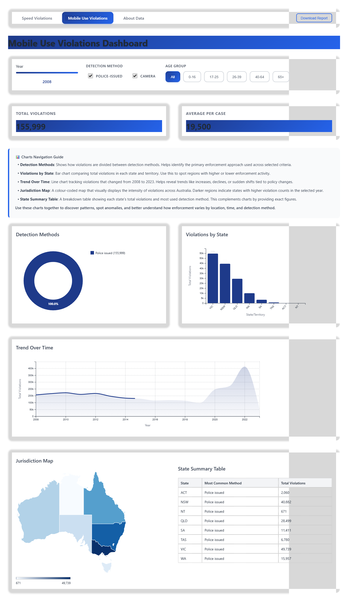
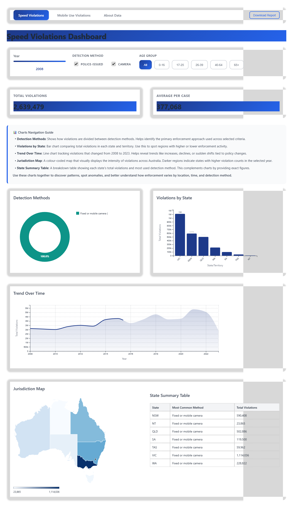

# Traffic_Violation_Dashboard# Traffic Safety Enforcement Dashboard

An interactive web dashboard for visualizing Australian traffic violation patterns, built with JavaScript and D3.js. This project empowers citizens and authorities to identify dangerous patterns by processing 2,852 violation records from 8 jurisdictions into user-friendly visualizations for better public safety decisions.

## Dashboard Screenshots

### Mobile Phone Violations Dashboard


The mobile phone violations dashboard shows comprehensive analysis of distracted driving enforcement across Australian jurisdictions. Features include real-time filtering by detection method, age groups, and temporal analysis from 2008-2023.

### Speed Violations Dashboard  


The speed violations dashboard provides detailed insights into speeding enforcement patterns, showing distribution across states, detection methods (police vs. camera), and trends over time with interactive choropleth mapping.

## Features

- **Empowers Public Safety**: Enables citizens and authorities to identify dangerous traffic violation patterns
- **Comprehensive Data Processing**: Analyzes 2,852 violation records from 8 Australian jurisdictions
- **Interactive Data Visualization**: Pie charts, bar charts, line charts, and custom SVG maps
- **Real-time Pattern Identification**: Instant filtering by year, detection method, and age group
- **KNIME-Preprocessed Data**: Complex enforcement datasets converted into user-friendly insights
- **Dual Dashboard Views**: Separate analyses for speed violations and mobile phone use while driving
- **Responsive Design**: Modern, glassmorphism-inspired UI that works across devices
- **Export Functionality**: Download dashboard reports as PNG images for presentations and reports

## Project Structure

```
traffic-safety-enforcement-dashboard/
├── README.md
├── package.json
├── package-lock.json
│
├── index.html              # Speed violations dashboard (main page)
├── mobile.html             # Mobile phone violations dashboard
├── about.html              # Data sources and methodology
├── style.css               # Global styles and responsive design
│
├── app.js                  # Main application logic for speed violations
├── mobile-app.js           # Application logic for mobile phone violations
├── data.js                 # Data loading and parsing utilities
│
├── charts/                 # D3.js visualization modules
│   ├── barChart.js         # Jurisdiction comparison charts
│   ├── lineChart.js        # Time series trend analysis
│   ├── mapChart.js         # Custom SVG Australian map visualization
│   └── pieChart.js         # Detection method distribution
│
├── data/                   # KNIME-preprocessed datasets
│   ├── speed_fines.csv     # Speed violation records (preprocessed)
│   └── mobile_fines.csv    # Mobile phone violation records (preprocessed)
│
└── images/                 # Custom graphics
    └── australia.svg       # Custom SVG map of Australian jurisdictions
```

## Quick Start

### Prerequisites
- A modern web browser
- A local web server (Live Server extension for VS Code, Python, or PHP)

### Setup

1. Clone or download the repository:
```bash
git clone https://github.com/yourusername/traffic-safety-enforcement-dashboard.git
cd traffic-safety-enforcement-dashboard
```

2. **Option 1: VS Code Live Server Extension**
   - Install the Live Server extension in VS Code
   - Right-click on `index.html` and select "Open with Live Server"
   - Navigate to the displayed localhost URL

3. **Option 2: Python HTTP Server**
```bash
# Python 3
python -m http.server 8000

# Python 2
python -m SimpleHTTPServer 8000
```

4. **Option 3: PHP Built-in Server**
```bash
php -S localhost:8000
```

5. Open your browser and navigate to the appropriate localhost URL

### File Structure Requirements

Ensure your directory structure matches:
```
project-root/
├── charts/
│   ├── pieChart.js
│   ├── barChart.js
│   ├── lineChart.js
│   └── mapChart.js
├── data/
│   ├── speed_fines.csv
│   └── mobile_fines.csv
├── images/
│   └── australia.svg
└── index.html
```

### Data Setup

The dashboard expects CSV files with the following structure:

**speed_fines.csv / mobile_fines.csv:**
- `START_DATE`: Date of the offense (YYYY-MM-DD format)
- `JURISDICTION`: State/territory code (NSW, VIC, QLD, etc.)
- `DETECTION_METHOD`: Either "Police issued" or "Fixed or mobile camera"
- `AGE_GROUP`: Age ranges (0-16, 17-25, 26-39, 40-64, 65+)
- `METRIC`: Type of measurement
- `FINES`: Numeric fine amount or count

## Technology Stack

- **Frontend**: Vanilla JavaScript, HTML5, CSS3
- **Data Visualization**: D3.js v7 for interactive charts and custom SVG mapping
- **Data Preprocessing**: KNIME Analytics Platform for dataset preparation and cleaning
- **Build Tools**: http-server for local development

## Dataset Overview

This dashboard processes **2,852 traffic violation records** spanning **8 Australian jurisdictions** (NSW, VIC, QLD, SA, WA, TAS, NT, ACT) from 2008-2023. The data has been preprocessed using KNIME Analytics Platform to ensure quality and consistency.

## Key Components

### Data Processing with KNIME
- **Dataset Cleaning**: KNIME workflows ensure data consistency across jurisdictions
- **Record Validation**: 2,852 violation records validated and standardized
- **Pattern Analysis**: Preprocessing enables efficient pattern identification
- **Quality Assurance**: Data quality checks and outlier detection

### D3.js Visualization Components
- **Custom SVG Maps**: Hand-crafted Australian jurisdiction boundaries
- **Interactive Filtering**: Real-time chart updates based on user selections
- **Pattern Recognition**: Visual highlighting of dangerous violation trends
- **Responsive Charts**: Adaptive visualizations for different screen sizes

### Application Logic
- **Reactive Filtering**: Real-time chart updates based on user input
- **State Management**: Centralized filter state across components
- **Event Handling**: Year slider, checkboxes, and age group buttons

## Data Methodology

The dashboard visualizes traffic enforcement data collected through:

- **Police-issued fines**: Manual enforcement by traffic officers
- **Fixed and mobile cameras**: Automated detection systems
- **Mobile phone detection**: Specialized camera systems for distracted driving

Data coverage spans 2008-2023 with annual updates, including:
- Geographic distribution across Australian jurisdictions
- Demographic breakdowns by age group
- Detection method effectiveness comparison
- Long-term enforcement trend analysis


### Data Integration
- CSV files should follow the established column naming convention
- New data sources require updates to the parsing logic in `data.js`

## License

This project is licensed under the MIT License - see the [LICENSE](LICENSE) file for details.

## Acknowledgments

- **Co-Contributor**: [Senuja Linal](https://github.com/senujalinal) - Collaborative development and technical contributions
- Data source: [Road_safety enforcement data 2024](https://www.bitre.gov.au/publications/2024/road-safety-enforcement-data)
- Built with D3.js visualization library
- Australian map data based on official geographic boundaries


